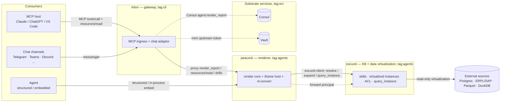
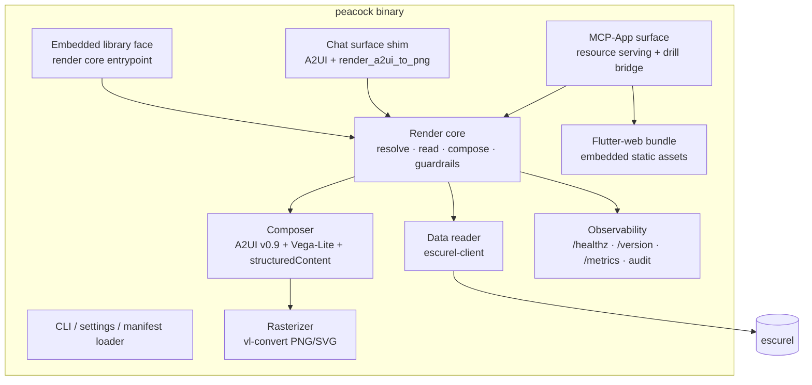
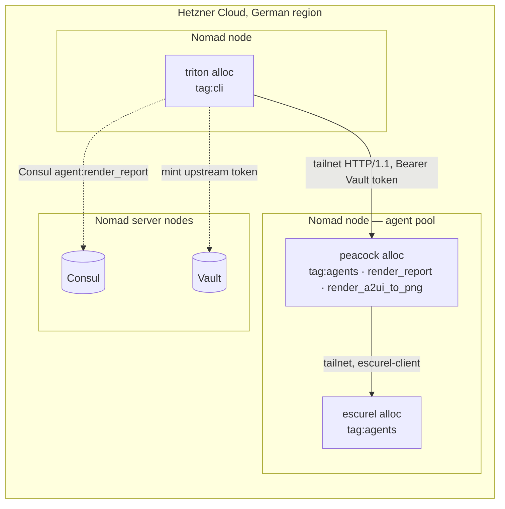

# peacock — Architecture (arc42)

Status: draft v0.1 (2026-06-27)
Companion to `BRD.md` in this directory. This is a high-level design;
the coding agent has freedom on details not pinned here. Where a
decision is fixed, an ADR in §9 says so and cites the constraint that
fixed it. No code is specified — diagrams, tables, and prose only.

**Blueprints.** peacock copies its *structure and approach* from two
existing DataZooDE components, not its responsibilities:

- **Triton** (`2026-05-22-triton-gateway-spec/architecture.md`) — the
  single-static-Rust-binary service shape: one central pivot that every
  surface funnels through, thin surface shells, stateless re-renders,
  stdout audit shipped by the substrate, Nomad/Consul/Vault/Tailscale
  deployment, `*-test-support` fakes, hand-rolled thin protocol layers
  over axum.
- **escurel** (`2026-06-20-escurel-instance-backends/HLD.md`,
  `2026-05-18-kb-rust-implementation-spec/`) — the `*-client` family
  (peacock depends on `escurel-client`), the credential/ACL boundary
  peacock must respect, and the per-tenant data model.

---

## 1. Introduction and goals

peacock is the **report renderer and MCP-App host** of the open
agent-reporting architecture. A single Rust binary (plus an embeddable
library crate) turns an escurel *report skill* + parameters into one
artifact — an A2UI v0.9 layout with Vega-Lite charts, structured content,
and on-demand PNG — and serves it on three surfaces: an MCP App (behind
Triton's MCP ingress), a chat channel (through Triton's adaptor), and as
structured content. It reads data only from escurel and holds no database
credentials.

Top quality goals, in priority order:

1. **Trust boundary.** peacock holds no database credentials and only
   ever sees rows escurel's fail-closed ACL has released. A compromised
   or buggy renderer cannot reach data it was not granted; render
   guardrails stop an agent-authored spec from fetching or computing
   beyond its rows.
2. **One artifact, many surfaces.** A single render core produces the
   artifact; the MCP-App, chat, structured, and embedded surfaces are
   thin shells over it. Consistency across surfaces is by construction.
3. **Statelessness.** No persistence, no server-side UI session. Every
   render is reproducible from `(report, params)`; drill state lives in
   parameters / signed tokens. Cattle-node friendly, like Triton.

## 2. Constraints

| # | Constraint | Source |
|---|---|---|
| C-1 | No public surface; peacock is reached only via Triton (MCP + chat) or embedded in-process. TLS/OIDC terminate at Triton/substrate. | BRD §1.1 D-3, NFR-S-2 |
| C-2 | No database credentials / no DSN / no source SQL in peacock; all data is rows from escurel with ACL already applied. | BRD §3.2, FR-D-2/3 |
| C-3 | Single static Rust binary + embeddable library crate; Rust-only golden-image baseline; no Node/Python runtime in the alloc. | BRD §1.1 D-1, NFR-O-2 |
| C-4 | iframe runtime is a Flutter-web bundle (A2UI v0.9 renderer + Vega custom component), built in CI, embedded as static assets. | BRD §1.1 D-2, FR-M-1 |
| C-5 | Stateless across restarts; in-flight render drain on SIGTERM. | BRD FR-L-1/2 |
| C-6 | Audit lines to stdout; substrate collector ships them. No self-hosted log shipper. | BRD FR-O-4; Triton C-6 |
| C-7 | Vega-Lite is the canonical chart payload; vl-convert (Rust, self-contained) is the rasterizer; no network egress from rendering. | BRD FR-V, NFR-S-5 |
| C-8 | Render guardrails: inline-data-only, restricted Vega expr, iframe sandbox. | BRD FR-V-4, NFR-S-3 |
| C-9 | peacock is an internal upstream agent behind Triton (Consul `agent:render_report`); identity is the Vault-minted token Triton forwards. | BRD FR-M-4, FR-I-1 |
| C-10 | escurel is the only data path, via `escurel-client`; the parameterized read `query_instance` is a cross-spec dependency. | BRD FR-D-1, §10 |
| C-11 | ggsql is optional and compiled escurel-side; never load-bearing in v1. | BRD FR-V-5 |
| C-12 | Untrusted parameters are carried as typed values and bound as prepared-statement parameters at execution; no component interpolates a param into SQL. peacock constructs no SQL. | BRD NFR-S-6, FR-D-6 |

## 3. Context and scope



**External actors:** MCP hosts, chat platforms, and agents — all reach
peacock **through Triton** (or embed it). escurel is peacock's only data
dependency. Consul/Vault are the substrate. **System boundary:** the
single `peacock` binary (with the embedded Flutter-web bundle) in one
Nomad allocation; Triton, escurel, Consul, Vault, and the external
sources are outside it.

## 4. Solution strategy

| Decision | Rationale |
|---|---|
| **Single stateless render core; surfaces are thin shells.** | Mirrors Triton's "one dispatcher, thin adapters". The artifact is composed once; MCP-App/chat/structured/embedded never diverge. |
| **escurel-client is the only data path; no DB driver in peacock.** | Keeps the trust boundary intact (escurel owns credentials + ACL). peacock is pure `(skill, params, rows) → artifact`. |
| **Untrusted parameters are bound, never spliced: prepared-statement parameters end-to-end.** | peacock builds no SQL and forwards typed values; escurel binds the view's `{{param}}` placeholders as query parameters. A parameter can change only a bound value, never query structure — SQL injection is structurally excluded, not filtered. |
| **Vega-Lite canonical; vl-convert embedded for PNG.** | Declarative, agent-emittable, safe; vl-convert is self-contained Rust (no Node, no network) — peacock *is* the chat rasterizer Triton delegates to. |
| **A2UI v0.9 layout + Vega custom component.** | Separates layout/interaction from graphics; uses A2UI's sanctioned custom-catalog extension point. |
| **Flutter-web iframe runtime, built in CI, embedded as assets.** | Decision D-2; aligns with `escurel_explorer_kit` lineage; keeps the runtime Rust-only (frontend toolchain is build-time only, like Triton's Lit runtime build step). |
| **peacock is an internal upstream behind Triton.** | Decision D-3; Triton already terminates TLS/OIDC, mints Vault tokens, and proxies MCP — peacock inherits identity for free and exposes no public port. |
| **Stateless re-renders; drill state in params/tokens.** | Triton ADR-5. Horizontal scale-out; renders reproducible from the audit log. |
| **Render guardrails at composition.** | inline-data-only + restricted Vega expr + iframe sandbox; the cheapest place to stop fetch/compute beyond the rows. |
| **Lean manifest with closed-set boot validation.** | Triton ADR-13 pattern: component catalog + render policy + escurel binding declared and validated at boot; Vault refs for secrets. |
| **Single static Rust binary, stdout audit, substrate ships it.** | Triton C-3/C-6; no self-hosted observability stack. |
| **ggsql optional, compiled escurel-side.** | Keeps spec-generation where the DuckDB connection lives; peacock always consumes Vega-Lite; no alpha dependency on the critical path. |

## 5. Building-block view

### 5.1 Level 1 (whitebox `peacock`)



### 5.2 Level 2 building blocks

| Block | Responsibility | Blueprint reference |
|---|---|---|
| **CLI / settings / manifest loader** | Entrypoint; CLI flags + `PEACOCK_*` env into a single `Settings`; loads the manifest (component catalog, render policy/guardrails, escurel binding), closed-checks enumerations, resolves Vault secret refs; refuses boot on any failure. Boots the service listeners + signal handler. | Triton `cli.rs`/`settings.rs`/manifest loader; ADR-13 pattern. |
| **Render core** | The single pivot `(report skill, params) → artifact`: resolve the skill, validate params, drive the data reader, invoke the composer, apply guardrails, emit the audit line. Every surface funnels through it. | Triton dispatcher (`dispatcher.rs`) as the single-pivot analogue. |
| **Data reader** | Calls `escurel-client` (`resolve`/`expand` the skill; `query_instance(ref, params)` per referenced view) passing **typed parameter values only** — escurel binds them as prepared-statement parameters; the data reader builds no SQL. Forwards principal/tenant; never caches across principals; surfaces typed `Data` errors. | escurel `escurel-client` crate; escurel HLD §3 dispatch. |
| **Composer** | Builds the A2UI v0.9 layout (KPI/table/text/controls), the `kind: vega` Vega-Lite chart components (rows injected inline), and the structuredContent (rows + param schema). One pass, pure. | Triton A2UI builders (`ui/builder_v09.rs`); CRM agent A2UI build approach (`2026-06-15-crm-sales-agent`). |
| **Rasterizer** | Vega-Lite → PNG/SVG via embedded vl-convert (Rust, no Node/network). Exposed as the `render_a2ui_to_png` capability Triton's chat surface delegates to. | Triton `Rasterizer` trait (chat surface §8.7) — peacock is its implementation. |
| **MCP-App surface** | Serves the `ui://peacock/<report>` resource (the Flutter-web bundle + the report's A2UI doc), returns the tool result linking it (`_meta.ui.resourceUri`) + structuredContent, and bridges `callServerTool`/`updateModelContext` into drill re-renders. Reached only via Triton's proxied MCP traffic. | MCP-Apps spec; Triton MCP adapter FR-A-6 (proxying extension, §10). |
| **Chat surface shim** | Returns pre-shaped A2UI to Triton's surface mapper and serves PNG rasterization; receives Triton-verified `(tool, args)` drills as fresh renders. | Triton surface mapper / upstream router (FR-U-5, FR-A-11). |
| **Embedded library face** | The render core as a library entrypoint for in-process Rust agents (authoring preview, inline default views); produces artifacts, does not host the iframe. | escurel-client embedding pattern; Triton `*-test-support` ergonomics. |
| **Flutter-web bundle** | The interactive iframe runtime: an A2UI v0.9 renderer with a Vega custom component (vega-embed via JS interop) that renders the artifact live and routes interactions back via the MCP-Apps channel. Built in CI; embedded as static assets. | `escurel_explorer_kit` (Flutter lineage); A2UI Flutter renderer. |
| **Observability** | `/healthz`, `/version` (binary + image + bundle SHA), tailnet-only `/metrics`, one stdout audit line per render. | Triton observability (§5.2, FR-O). |
| **escurel-client (dep)** | Typed client to escurel (resolve/expand/query_instance), forwarding principal/tenant. | escurel `escurel-client` crate. |

## 6. Runtime view

### 6.1 Render (steady state, any surface)

```
surface shell (MCP-App | chat | structured | embedded)
  → render_core(report_id, params, principal)
       ├─ escurel-client.resolve/expand(report skill)
       ├─ validate params against the skill's parameter schema
       ├─ for each [[view ref]]: escurel-client.query_instance(ref, params, principal)
       │      └─ typed params bound as prepared-statement parameters (no SQL string built)
       │      └─ escurel applies fail-closed ACL; returns aggregated rows
       ├─ composer: A2UI v0.9 layout + kind:vega (rows inline) + structuredContent
       ├─ guardrails: reject remote data / disallowed Vega expr
       ├─ (chat) rasterizer: vl-convert → PNG
       ├─ emit audit line {tenant, report, params_hash, surface, result, latency_ms, trace_id}
       └─ return artifact
```

### 6.2 MCP-App (behind Triton)

```
MCP host → Triton MCP ingress (TLS + OIDC verify, mint Vault token)
  → Triton proxies tools/call render_report → peacock MCP-App surface
       → render_core → artifact (structuredContent + A2UI)
  ← peacock returns structuredContent + _meta.ui.resourceUri = ui://peacock/<report>
  → MCP host resources/read ui://peacock/<report>
       → Triton proxies → peacock serves the Flutter-web bundle (sandboxed iframe)
  → iframe renders A2UI live (Vega via vega-embed)
  → in-iframe drill: app.callServerTool(render_report, new params)
       → Triton proxies → peacock render_core (fresh render) → updated artifact
```

### 6.3 Chat (through Triton)

```
user@channel → Triton chat adaptor (inbound, identity)
  → Triton calls peacock: render_report → A2UI ; render_a2ui_to_png → PNG
  → Triton surface mapper projects A2UI + embeds PNG per channel; posts
  → drill tap → Triton verifies HMAC token → peacock render_core (fresh render)
```

### 6.4 Cold start

```
nomad alloc start
  → load settings (CLI + env)
  → load manifest; closed-check enumerations; resolve Vault secret refs; refuse on failure
  → resolve escurel endpoint (Consul/Nomad-template)
  → bind tailnet service listeners + tailnet metrics listener (no public port)
  → mount embedded Flutter-web bundle for the resource path
  → /healthz returns 200
  → first render: escurel resolve/query_instance cold path
```

### 6.5 Drill (both interactive surfaces)

Drills carry only parameters: an MCP-App `callServerTool` or a
Triton-verified chat token both re-enter the render core as a fresh
`(report, params)` render. No server-side conversation/UI state is held;
the artifact is reproducible from the parameters alone.

### 6.6 State synchronization (visualization ↔ conversation)

A committed drill mutates the params **and** informs the conversational
model, so the selection is available for follow-ups (incl. other
visualizations):

```
human taps category=Beverages in the iframe
  ├─ callServerTool('render_report', {report, params(absolute, category=Beverages)})
  │     → peacock render_core → re-rendered artifact → iframe updates
  └─ updateModelContext({report_id, params, salient_summary})   # compact, no rows
        → host appends view state to the model's context
later: agent reasons over the view state (and the tool result's
       structuredContent.params) and can drive the viz back —
       agent → render_report(params') → iframe updates (bidirectional)
```

Invariants: state is `(report_id, params)` only (no hidden viz state);
the conversation/host is the authoritative holder; drills carry the
**absolute** parameter vector (not deltas) so the two projections cannot
drift; only **committed** selections are promoted (hover/zoom stay local);
the pushed record is **compact** (state, not data — full rows stay in
`structuredContent`). On A2UI hosts the push is the v0.9 client-to-server
data-sync/event; on the Triton chat path the signed `(tool,args)` token is
the carrier, surfaced to a mediating agent as a tool call. peacock remains
stateless throughout (it never holds the running state). See BRD §5.6
(FR-X) and OQ-5 (shared exploration selection vs per-report params).

## 7. Deployment view



**Nomad job** (one): peacock registers in Consul as
`agent:render_report` (and the `render_a2ui_to_png` capability); carries
`tag:agents` and **no** Fabio `urlprefix-` tag (invisible to the public
ingress). Tailscale ACL grants only Triton (`tag:cli`) → peacock
(`tag:agents`). A tailnet-only `metrics` port. `GET /version` returns
`{image_sha, binary_sha, bundle_sha}`.

**Packer golden image:** the existing Rust-only baseline (libc only).
The peacock binary embeds the prebuilt Flutter-web bundle as static
assets; **no Node/Flutter runtime ships in the image** — the Flutter
build is a CI step that produces the static bundle the binary embeds
(directly analogous to Triton's Lit-runtime build step being build-time
only).

## 8. Cross-cutting concepts

### 8.1 Configuration
`CLI flags > PEACOCK_* env > defaults` for process settings; a lean
manifest declares the A2UI component catalog (incl. the `vega` custom
component), the render policy/guardrails, and the escurel binding.
Closed-set boot validation; Vault refs mandatory for secrets in
production (Triton ADR-13 pattern).

### 8.2 Trust boundary & guardrails
peacock never holds DB credentials; escurel releases only ACL-checked
rows. The render guardrail (inline-data-only, restricted Vega expr) plus
the Flutter iframe sandbox bound what a rendered artifact can do to
exactly its rows. The forwarded principal token is Vault-minted and
short-lived (≤ 5 min).

**SQL injection.** Report parameters are untrusted (agent- and
user-supplied). peacock constructs no SQL and forwards typed values only;
escurel binds a structured data view's `{{param}}` placeholders as
**prepared-statement parameters**, never by textual substitution, so a
parameter can only ever change a bound *value*, not the query structure.
Parameters are type-checked against the report skill's declared scalar
types before the call (FR-R-4/FR-D-6), and identifier-position params
(column/table names) are allowlist-validated. For the optional ggsql path,
where a fresh connection precludes session-bound parameters, inputs are
injected as type-checked literals via a safe allowlist — never raw
concatenation. (BRD NFR-S-6, C-12.)

### 8.3 Error model
Typed errors `Auth | Validation | Data | Render`, mapped per surface
(MCP JSON-RPC code; chat error; library `Result`). Surfaces MUST NOT
inspect inner messages to decide mapping — the variant decides. (Triton
§8.3 pattern.)

### 8.4 Logging vs audit
Two stdout channels by JSON `kind`: `log` (diagnostic) and `audit` (one
line per render). Substrate collector ships audit lines. Rows, tokens,
and PII never appear in either. (Triton §8.2.)

### 8.5 Statelessness & re-render
No persistence; no server-side UI session. Drill = fresh render from
parameters. Renders reproducible from the audit log. (Triton ADR-5.)

### 8.6 Testing
Mirror the blueprint harness: a `peacock-test-support` crate with a
`PeacockProcess::spawn` and a **`FakeEscurel`** (canned skills + rows +
ACL outcomes) so surface and render-core tests run with no real escurel.
Release-blocking tests: (i) **single-render-path parity** across
MCP-App/chat/structured/embedded; (ii) **guardrail** rejection of
remote-data/expr; (iii) **ACL pass-through** (denied view → typed error,
no partial render); (iv) **stateless re-render** reproducibility; (v)
**cold start / SIGTERM drain**; (vi) **manifest closed-set** boot
refusal. (Triton §8.5; escurel `escurel-test-support`.)

### 8.7 Build & packaging
`cargo build --release` → single static binary embedding the prebuilt
Flutter-web bundle. CI stages: Flutter-web build (frontend, build-time
only) → embed bundle → Rust build → Packer copies the binary; binary +
bundle SHAs pinned and returned by `/version`. CI matrix: `linux/x86_64`
release-blocking; `aarch64`/`macos-arm64` best-effort.

### 8.8 The optional ggsql compile path
When a chart is authored in ggsql, compilation to Vega-Lite happens where
the DuckDB connection lives (escurel-side); peacock receives a Vega-Lite
spec and renders it unchanged. peacock has no ggsql dependency on the
critical path. Gated on ggsql past alpha and OQ-1 (does `spec` mode
inline data). (BRD §7, §9.)

## 9. Architecture decisions (ADRs, condensed)

| ID | Decision | Why |
|---|---|---|
| ADR-P1 | **Single static Rust binary + embeddable library crate.** | Decision D-1; matches the Triton/escurel substrate baseline; in-process embedding for Rust agents. |
| ADR-P2 | **escurel-client is the only data path; no DB driver/credential in peacock.** | Keeps the trust boundary; escurel owns credentials, virtualization, ACL. peacock is pure `(skill, params, rows) → artifact`. |
| ADR-P3 | **Vega-Lite canonical; vl-convert embedded for PNG/SVG; peacock is the chat rasterizer.** | Declarative/safe/agent-emittable; self-contained Rust rasterizer (no Node/network); satisfies Triton's `render_a2ui_to_png`. |
| ADR-P4 | **A2UI v0.9 layout + `kind: vega` custom component.** | Separates layout/interaction from graphics via A2UI's sanctioned custom-catalog extension. |
| ADR-P5 | **Flutter-web iframe runtime, CI-built, embedded as static assets.** | Decision D-2; aligns with `escurel_explorer_kit`; runtime stays Rust-only (frontend is build-time only). |
| ADR-P6 | **peacock is an internal upstream behind Triton's MCP ingress.** | Decision D-3; reuse Triton's TLS/OIDC/Vault/proxy; no public port; identity is the Vault-minted forwarded token. |
| ADR-P7 | **Stateless re-renders; drill state in params/tokens; no server-side UI session.** | Triton ADR-5; scale-out + reproducible renders. |
| ADR-P8 | **Render guardrails at composition: inline-data-only, restricted Vega expr, iframe sandbox.** | Stops an agent-authored spec from fetching/computing beyond its rows. |
| ADR-P9 | **One render core; surfaces are thin shells.** | Triton's single-pivot pattern; cross-surface consistency by construction. |
| ADR-P10 | **ggsql optional, compiled escurel-side; not load-bearing in v1.** | Keeps spec-gen at the DuckDB connection; peacock always consumes Vega-Lite; no alpha dependency on the critical path. |
| ADR-P11 | **Lean manifest + closed-set boot validation; Vault refs for secrets.** | Triton ADR-13. |
| ADR-P12 | **Stdout audit; substrate ships it.** | Triton ADR-7; no self-hosted log shipper. |
| ADR-P13 | **License BSL-1.1 → MPL-2.0 (match escurel).** | Suite consistency; pending OQ-4 confirmation. |
| ADR-P14 | **Untrusted params are typed values bound as prepared-statement parameters; peacock builds no SQL.** | SQL-injection cut: a param can change only a bound value, never query structure; type-check + identifier allowlist; ggsql path uses type-checked literals. (BRD NFR-S-6, FR-D-6, C-12.) |
| ADR-P15 | **View state = the parameter vector; the conversation is authoritative; sync via `updateModelContext` + `structuredContent`; absolute params, not deltas.** | Collapses "sync two stateful things" to "keep one value visible to both": a committed drill re-renders (callServerTool) and pushes a compact view-state record to the model; agents read it (and can drive the viz back). peacock stays stateless. (BRD FR-X.) |

## 10. Quality scenarios

| Scenario | Stimulus | Expected response |
|---|---|---|
| **ACL denial** | A principal lacks access to a referenced view. | escurel returns denial; peacock surfaces a typed `Data`/`Auth` error; no partial render. |
| **Hostile chart spec** | A report skill's chart loads a remote URL or disallowed expr. | Guardrail rejects with `Render` error; metric increments. |
| **SQL-injection attempt** | A drill/param value carries SQL metacharacters (`'; DROP …`, `1 OR 1=1`, UNION). | Bound as a prepared-statement parameter — changes only the value, never the query; non-conforming type rejected pre-call; peacock emits no SQL. (NFR-S-6, ADR-P14.) |
| **Drill** | Iframe `callServerTool` / chat token with new params. | Fresh render from params; identical to a direct call with those params (statelessness). |
| **State sync** | Human drills in the iframe; later asks the agent a follow-up about it. | Drill pushed via `updateModelContext` (compact `{report,params,summary}`) + carried in `structuredContent`; agent answers / spawns another viz using the drilled selection. (FR-X, ADR-P15.) |
| **Partial host support** | Host lacks `updateModelContext` (or A2UI data-sync). | Degrade to the tool-call record + `structuredContent.params` as the state carrier; no silent desync. |
| **escurel slow/unavailable** | escurel read times out. | Typed `Data` error; bounded; no partial/hung render; metric + alert. |
| **A2UI version drift** | An A2UI v1.0 host appears. | Add a builder/renderer variant; the render core and data path are unchanged. |
| **Surface divergence regression** | A change makes one surface's artifact differ. | Single-render-path parity test fails; CI blocks merge. |
| **Oversized result set** | A view returns far more rows than renderable. | Bounded rejection (`Render` error), not unbounded rasterization. |
| **Cold start / SIGTERM** | Fresh alloc; SIGTERM mid-render. | Clean bind + `/healthz`; in-flight renders drain; exit 0. |

## 11. Risks and technical debt

| Risk | Likelihood | Impact | Mitigation |
|---|---|---|---|
| Flutter-web + vega-embed integration friction (JS interop in the iframe). | Medium | Medium | Spike the Vega custom component early; the chat/PNG path (vl-convert) is independent and ships regardless. |
| escurel `query_instance` (parameterized result-set read) not yet built. | High | High | Cross-spec dependency (§ BRD 10, OQ-2); coordinate with escurel; until then, peacock can target a flapi/templated-SQL read behind the same interface. |
| Triton MCP-Apps proxying (resources/read + `_meta.ui.resourceUri` + callServerTool relay) not yet built. | High | High | Cross-spec dependency on Triton; the chat + embedded surfaces do not need it, so they can land first if needed. |
| Guardrail subset for Vega expr too strict or too loose. | Medium | Medium | Start strict (deny expr/remote data); widen with documented, tested allowances; tests assert rejection. |
| ggsql alpha churn if adopted prematurely. | Medium | Low | Optional + escurel-side compile; gated on OQ-1 and maturity; never on the critical path. |
| Embedded bundle bloat (Flutter web). | Medium | Low | Measure bundle SHA/size in `/version` and CI; tree-shake; the bundle is build-time, not a runtime dep. |

## 12. Glossary

See `BRD.md` §2. Additional terms used here:

- **Render core** — the single pivot `(report skill, params, rows) →
  artifact`; the peacock analogue of Triton's dispatcher.
- **Surface shell** — a thin adapter (MCP-App, chat, structured,
  embedded) over the render core; carries no composition logic.
- **Artifact** — `{a2ui_v0.9, vega_specs, structuredContent, png?}`
  produced by one render.
- **Structured data view** — escurel-owned virtualized `sql_view`
  instance peacock reads via `query_instance` (escurel HLD §5).
- **`render_a2ui_to_png`** — the rasterization capability peacock exposes,
  which Triton's chat surface delegates dashboard rendering to.
- **FakeEscurel** — the `peacock-test-support` double (canned skills,
  rows, ACL outcomes) for harnessed tests, mirroring escurel's
  `escurel-test-support`.
